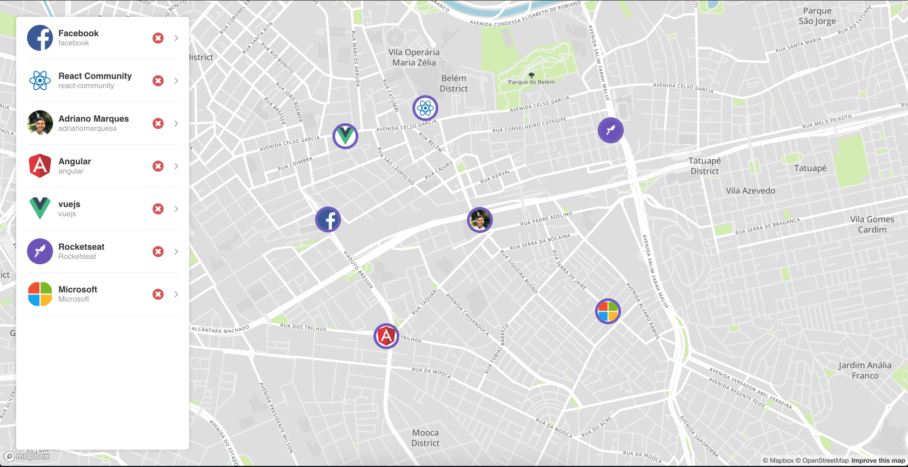

# Github Maps

Learning [ReactJS](https://reactjs.org/), project developed in the course of [RocketSeat](https://github.com/RocketSeat).

Created map using

- [Uber react-map-gl](https://github.com/uber/react-map-gl)
- [Mapbox GL](https://github.com/mapbox/mapbox-gl-js)

